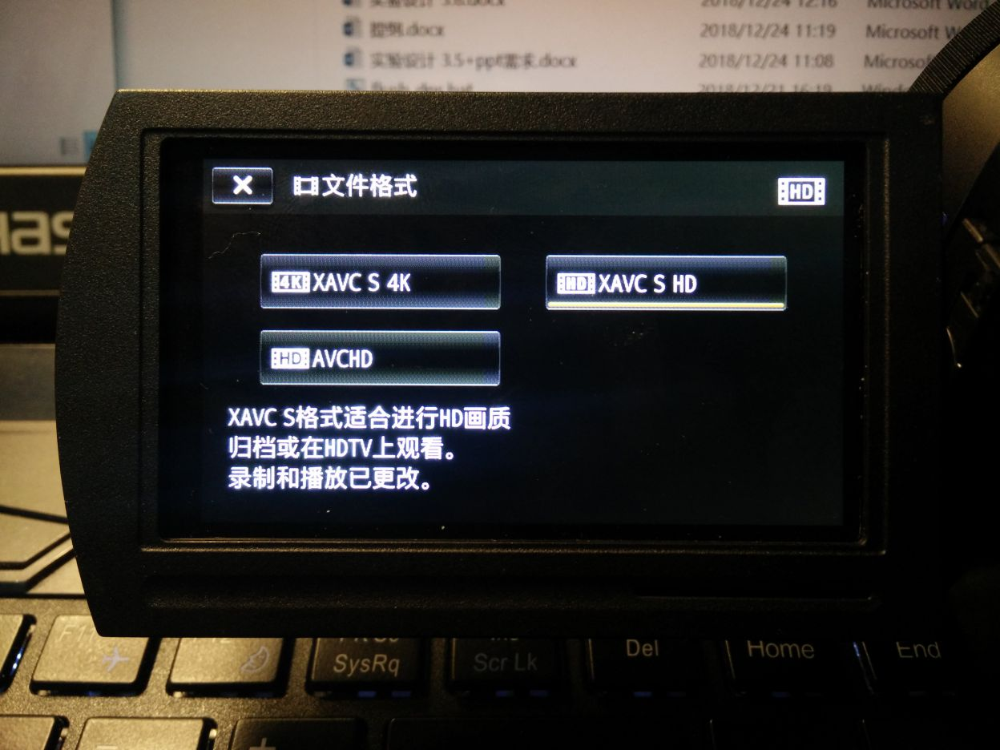
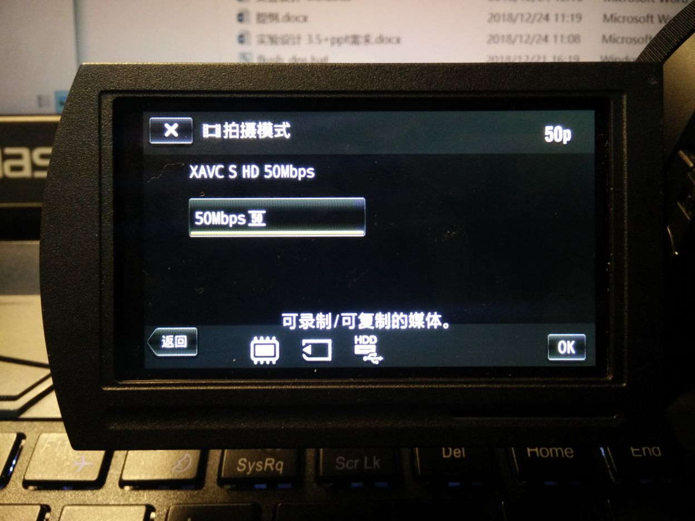
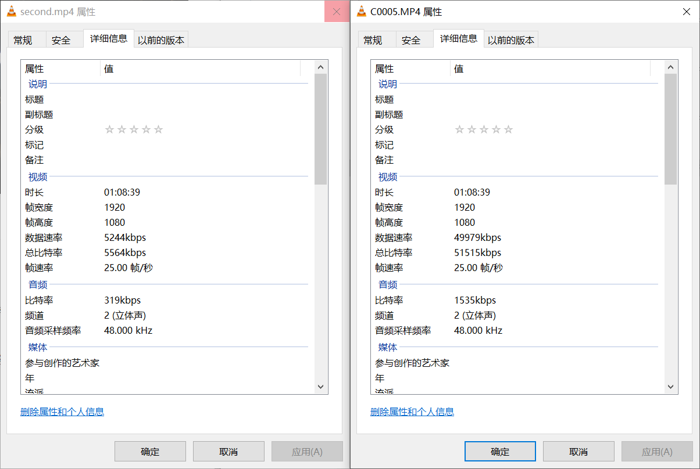

# 压制上传攻略

## 目录

在本攻略中，我们希望掌握

- DV 的基本设定技巧
- 视频的压制
- 视频的剪辑
- 视频的上传

## DV 的基本设定技巧

为了让之后的剪辑流程不是这么痛苦，我们需要对 DV 的录制设置进行适当的调整。

一般来说，SONY 的 DV 内置储存器容量都不算太小，可以录制 2 小时左右 50Mbps 码率的视频，这里我们要选择 XAVC S HD 格式，如下图

**千万不要选择 AVCHD ！千万不要选择 AVCHD ！千万不要选择 AVCHD ！**这会让之后的剪辑工作痛不欲生（

本型号机器上 XAVC S HD 格式码率是 50Mbps，如下图

## 视频的压制

### 压制的目的与效果

一般而言，我们可能会拿到一个很长的视频（~半场），或者很多个小的视频（~节目）。无论如何，我们都应先进行压制。

50 Mbps 的码率无论如何都是非常冗余的，即便是存储上也是较为昂贵的。因此，压制后一般我们需要两个结果

1. 人眼无法识别的压制品，品质接近原片但是体积缩小许多（体积可压缩至1/10，即 CRF 18）
2. 适合在网络上传播的压制品，品质适中（码率可进一步压缩至1Mbps，即 CRF 22.5）

如上图所示，左边是 CRF 18 的压缩结果，右边是原视频，体积压缩效果相当出色。

### 压制步骤

1. 安装 [小丸工具箱](https://maruko.appinn.me/)
2. 使用 视频->批量压制 功能，音频模式可选择 “复制音频流” 或者压制，视情况而定
3. 等待压制结束

注：

- 编码器选 x264_64-8bit 就可以，选 10bit 颜色或者 x265 编码器暂时没有意义
- 建议“保持原分辨率”
- CRF 越大压制效果越差（即体积和画质的 trade-off ），红线是不要高于 27 ，一般 23.5 可以接受
- 隔夜压制的时候可以“自动关机”