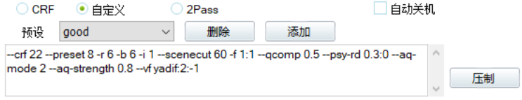

# 压制上传攻略

## 目录

在本攻略中，我们希望掌握

[TOC]

## DV 的基本设定技巧

为了让之后的剪辑流程不是这么痛苦，我们需要对 DV 的录制设置进行适当的调整。

一般来说，SONY 的 DV 内置储存器容量都不算太小，可以录制 2 小时左右 50Mbps 码率的视频，这里我们要选择 XAVC S HD 格式，如下图


**千万不要选择 AVCHD ！千万不要选择 AVCHD ！千万不要选择 AVCHD ！** 这会让之后的剪辑工作痛不欲生（

本型号机器上 XAVC S HD 格式码率是 50Mbps，如下图


## 视频的压制

### 压制的目的与效果

一般而言，我们可能会拿到一个很长的视频（~半场），或者很多个小的视频（~节目）。无论如何，我们都应先进行压制。

50 Mbps 的码率无论如何都是非常冗余的，即便是存储上也是较为昂贵的。因此，压制后一般我们需要两个结果

1. 人眼无法识别的压制品，品质接近原片但是体积缩小许多（体积可压缩至1/10，即 CRF 18）
2. 适合在网络上传播的压制品，品质适中（码率可进一步压缩至1Mbps，即 CRF 22.5）


如上图所示，左边是 CRF 18 的压缩结果，右边是原视频，体积压缩效果相当出色。

### 压制步骤

1. 安装 [小丸工具箱](https://maruko.appinn.me/)
2. 使用 视频->批量压制 功能，音频模式可选择 “复制音频流” 或者压制，视情况而定（可以在原始->CRF 18过程中压制音频，CRF 18->CRF 22的过程中复制音频流）
3. 等待压制结束

注：

- 压制 CRF 22 的视频源应选择 CRF 18 的压制结果，因为如果使用 50 Mbps 视频的话，大部分时间是花在解码原视频而非编码新视频
- 编码器选 x264_64-8bit 就可以，选 10bit 颜色或者 x265 编码器暂时没有意义
- 建议“保持原分辨率”
- CRF 越大压制效果越差（即体积和画质的 trade-off ），红线是不要高于 27 ，一般 23.5 可以接受
- 隔夜压制的时候可以“自动关机”

###  反交错

有时候我们可能拿到了一份视频，在暂停时会出现卡齿状的凹凸条纹，这一般是由于**交错(Interlacing)**引起的。用小丸工具箱可以查看视频是否是交错编码的：

```
扫描方式：隔行扫描
...
Scan type                                : Interlaced
Scan type, store method                  : Separated fields
Scan order                               : Top Field First
```

而逐行扫描的视频文件则是这样的：

```
扫描方式：逐行扫描
...
Scan type                                : Progressive
```

为了提高视频 <del>截图生成表情包</del> 的质量，最好在压制的同时进行反交错，方法是自定义压制参数：

```bash
--crf 22 --preset 8 -r 6 -b 6 -i 1 --scenecut 60 -f 1:1 --qcomp 0.5 --psy-rd 0.3:0 --aq-mode 2 --aq-strength 0.8 --vf yadif:2:-1
```



最重要的是以下三点

1. CRF 参数需要手动调整
2. 去掉默认附件的 `--vf resize:960,540,,,,lanczos` ，这是缩放视频的选项
3. 加上 yadif 编码插件，具体参数使用见 [FFmpeg Filters Documentation](https://ffmpeg.org/ffmpeg-filters.html#yadif-1)

注：反交错会较显著地延长压制时间。


## 视频的剪辑

不选择 AVCHD 的一个理由就是：我们还需要多进行一步进行时间差的矫正。

### 矫正时间差

对于 `.MTS`  格式的文件，有时候音视频自带一个时间差，通过小丸工具箱可以查看：

```
Compression mode                         : Lossy
Delay relative to video                  : -80 ms
Stream size                              : 95.4 MiB (5%)
```

中间一行 delay 就是时间差，这里负号应该是音频落后于视频；落后的话比较好处理。

通常解决办法是以视频为准，调整音频。首先摸出小丸工具箱，在“抽取”页面抽出音频轨，编辑完之后再通过“封装->合并为MP4”的替换音频功能塞回去。

对于音频的剪切，这里介绍两种解决办法：

1. 使用音频剪辑软件剪去 80 ms 的开头内容
2. （硬核但是更简单）使用 ffmpeg 命令 ``ffmpeg -ss 00:00:00.080 -i input.mp3 -c copy output.mp3``

注：

- 对于 5.1 声道我没试过，自己自求多福吧（
- ffmpeg 命令的含义在附录里会简单介绍

### 切割

出于美观、分割 <del>和强迫症</del> 的需要，我们一般需要把一个较长的视频分为若干个较小的视频片段，工具还是 ffmpeg。

首先，摸出一张纸，我们需要记录每个想要的片段开始和结束的位置，精确到秒即可，如下表

| 视频源    | 节目简称     | 开始时间 | 结束时间 | 长度  |
| --------- | ------------ | -------- | -------- | ----- |
| C0001.mp4 | 0 上半场导赏 | 00:05    | 03:13    | 03:08 |
| ……        |              |          |          |       |

有了这个表我们就可以编写相应的脚本了，格式如下

```bash
#!/bin/sh
ffmpeg -ss 00:00:05 -i C0001.mp4 -to 00:03:08 -c copy -avoid_negative_ts 1 0_sbcds.mp4
# ...
```

然后执行该脚本，不出几分钟就能剪好。

### 连接

在一些非常奇特的条件（如文件系统大小限制）下，可能一个节目中间被分割到了前后两段视频，我们需要把它们连接起来，这也可以用 ffmpeg [做到](https://trac.ffmpeg.org/wiki/Concatenate)。

```bash
echo -e "file 'input1.mp4'\nfile 'input2.mp4'" > list.txt # 或者之间编辑相应的文本文件
ffmpeg -f concat -i list.txt -c copy output.mp4
```


## 视频的发布

度盘存的是 CRF 22 版本，视频网站上传 CRF 18 的版本，可能会被二压，但是应该也比 CRF 22 好。

### [B 站](https://member.bilibili.com/v2#/upload/video/frame)

<del>写稿时投稿通道居然是畅通，活久见</del>

- 一般分区投“演奏”，这样曲目介绍可以写很多字（（，包括标题、乐章、演奏人员等
- 封面图参见度盘美工资源

### [Youtube](https://www.youtube.com/upload)

- 需要填写的项目应该都差不多
- 大小上限是 12小时 和 128G ，我觉得应该超不过


## 附录：补充知识

### shell 快速入门

- 运行命令 `./script.sh` ，这里 `./` 表示当前目录下的 blabla ，后面跟文件名就行
- 在运行脚本前需要先赋予可执行权限 `chmod +x script.sh` ，脚本的扩展名一般是 `.sh` （不加扩展名也可在 bash 下运行），脚本第一行一般加释伴 `#!/bin/sh`
- 列出当前目录下的文件：`ls` 或 `ls -l`
- 创建新目录：`mkdir new_dir`

### ffmpeg 专题（

#### 将 ffmpeg 添加到 $PATH

见 [方便使用FFMPEG的经验](https://blog.csdn.net/leixiaohua1020/article/details/19016469)

#### 命令含义

[文档](https://ffmpeg.org/ffmpeg-all.html) 在此

- `-ss position (input/output)`  在输入流中截取 position 之前最近的关键帧开始，读入输入流的内容。一般来说配合 `-c copy` 的时候，如果关键帧比较少的话，实际编码出来的内容可能比给定的时间点早一点。
- `-to position (input/output)` 指定截取片段长度，注意是想要的长度而不是实际截取末尾的时间点，所以要提前做个减法。
- `-avoid_negative_ts 1` 魔法